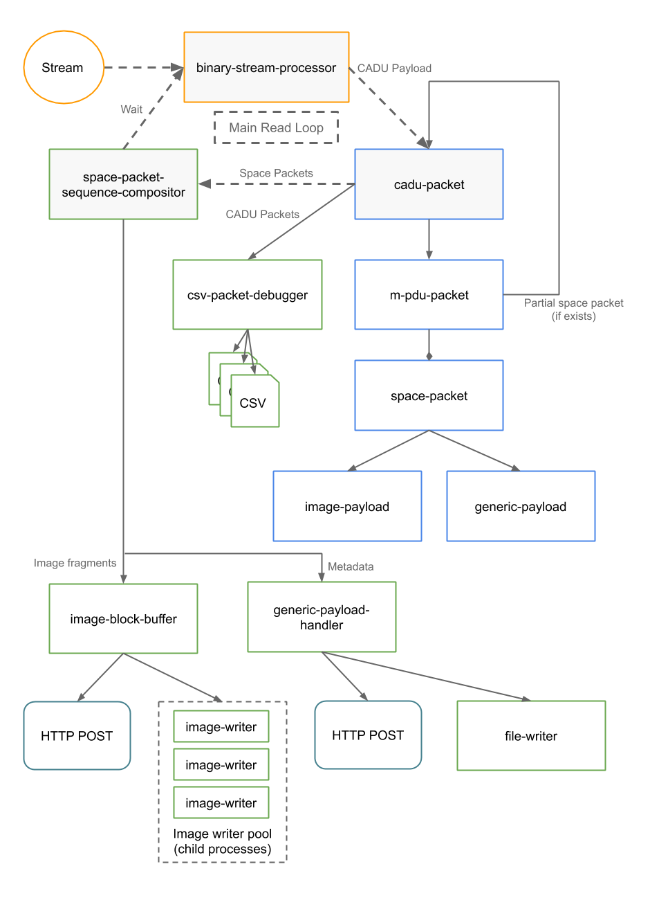

# goes-r-packet-decoder
NodeJS process for decoding GOES-R packets.

Features
  - Space packet sequence compositing
  - Image block buffering of image fragments
  - Stream packet headers to CSV files for debugging
  - Write to local disk (via worker pool) [in progress]
  - POST to remote service for processing [TODO]

